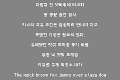
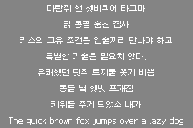
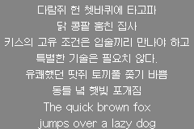
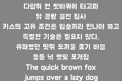

# gba-free-fonts
Free font resources for GBA game development

This repo contains many free-to-use fonts which are ready-to-use in your GBA project.

**Note:** source code are under [zlib license](https://github.com/laqieer/gba-free-fonts/blob/main/LICENSE), fonts are under their own licenses.

## Fonts & Licenses

This branch `galmuri` features [Galmuri Korean fonts](https://galmuri.quiple.dev/) for [Butano](https://github.com/GValiente/butano).\
본 `galmuri` 브랜치는 [Butano](https://github.com/GValiente/butano) 엔진용 [갈무리체](https://galmuri.quiple.dev/)를 포함하고 있습니다.

|Font|License|Characters|Preview|
|---|---|---|---|
|[Galmuri7 Regular](https://galmuri.quiple.dev/)|[SIL OFL 1.1](licenses/OFL.md) ([한국어](licenses/OFL-ko.md))|13059||
|[Galmuri9 Regular](https://galmuri.quiple.dev/)|[SIL OFL 1.1](licenses/OFL.md) ([한국어](licenses/OFL-ko.md))|20507||
|[Galmuri11 Regular](https://galmuri.quiple.dev/)|[SIL OFL 1.1](licenses/OFL.md) ([한국어](licenses/OFL-ko.md))|20739||
|[Galmuri11 Bold](https://galmuri.quiple.dev/)|[SIL OFL 1.1](licenses/OFL.md) ([한국어](licenses/OFL-ko.md))|11146||
|[Galmuri11 Condensed](https://galmuri.quiple.dev/)|[SIL OFL 1.1](licenses/OFL.md) ([한국어](licenses/OFL-ko.md))|13077||

## Guide

### For [Butano](https://github.com/GValiente/butano)

[This is an example](https://github.com/laqieer/gba-dev-best-practice/commit/01f91a3e08a6f61ec0c0b8fbb60eab62121172fc) to show how to use a font in your project.

1. Install [Pillow](https://pillow.readthedocs.io/en/stable/installation.html)
```sh
# For MSYS2/MinGW-w64 users
pacman -S mingw-w64-x86_64-python-pillow
# For WSL2/Ubuntu/Debian users
sudo apt-get install python3-pil
# For Mac users
brew install pillow
# For FreeBSD users
pkg install py38-pillow
# For CentOS users
yum install python3-pillow
# For Fedora Linux users
dnf install python3-pillow
# For Arch Linux users
pacman -S python37-pillow
```
2. Set path in `Makefile`
```Makefile
# FONTS is a list of directories containing font files.
FONTS       :=  
# TEXTS is a list of directories or filenames containing text files.
TEXTS       :=  
```
3. Bind it to a `bn::sprite_text_generator` in source code
```C++
#include "xxx_sprite_font.h"
bn::sprite_text_generator text_generator(xxx_sprite_font);
```

## [Others](https://github.com/laqieer/gba-free-fonts/blob/main/others.md)

*History: it starts [here](https://github.com/GValiente/butano/pull/18).*
